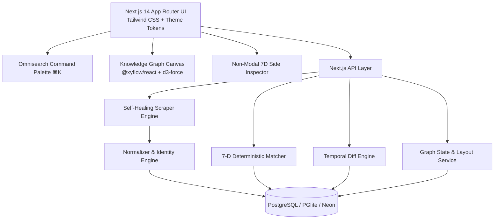

# CareerVerse

> Autonomous career intelligence that continuously discovers, understands, and connects opportunities to you.

[](https://careerverse-lime.vercel.app)
[](https://nextjs.org/)
[](https://www.typescriptlang.org/)
[](https://github.com/electric-sql/pglite)
[](https://orm.drizzle.team/)
[](https://d3js.org/)
[](https://reactflow.dev/)
[](https://vitest.dev/)
[](https://opensource.org/licenses/MIT)

---

CareerVerse continuously monitors target company career pages, detects scraper failures and structural drift, self-heals degraded extraction pipelines, maintains temporal job history across snapshots, calculates transparent 7-dimensional candidate-job matches, and visualizes the resulting career network as a live physics-based knowledge graph.

---

## ✦ What CareerVerse Does

### 🧠 Career Intelligence
Evaluates opportunities against a deterministic 7-dimensional matching engine, synthesizing transparent fit scores without external black-box AI dependencies.

### 🕸️ Living Knowledge Graph
Maps `Candidate → Jobs → Companies → Skills → Technologies → Locations → Domains` through a real, continuous force-directed physics simulation.

### 🩹 Self-Healing Scraper Engine
Actively monitors extraction health, detects DOM schema drift when companies redesign career pages, tests replacement selectors, and executes an automated recovery workflow.

### ⏳ Temporal Job History
Maintains discrete snapshot diffs, tracking salary adjustments, requirement shifts, and role lifecycle states (`OPEN`, `CLOSED`, `REOPENED`).

### 🎯 Explainable Matching
Every score is backed by granular dimension progress bars, verified positive match criteria (`✓`), and identified skill gaps (`−`).

### 🔔 Continuous Monitoring & Radar
Provides unified telemetry across monitored target portals, live extraction accuracy, instant alert feeds, and keyboard-first omnisearch (`⌘K`).

---

## 🕸️ The Living Career Graph

The CareerVerse graph is **not a static SVG or pre-baked visualizer**. It is a continuous, physically-simulated relational network powered by **`@xyflow/react`** and **`d3-force`**.

```text
                        [ Candidate Anchor ]
                         /        |        \
                   ( Skills )  ( Jobs )  ( Technologies )
                     /            |            \
              [ Locations ]  [ Companies ]  [ Domains ]
```

### Physical Simulation Dynamics:
- **Continuous Spring Constraints**: Edges behave as physical springs with distance and strength parameters proportional to relationship affinity.
- **Many-Body Node Repulsion & Collision Handling**: Non-overlapping bounding boxes prevent node clustering and maintain spacious layout readability.
- **Interactive Drag & Natural Settling**: Dragging any entity flexes connected nodes; releasing allows the network to settle smoothly with alpha cooling without jerky restarts.
- **Neighborhood Focus Mode**: Selecting any role or company isolates its 1-degree network and dims unrelated entities to 10% opacity, opening a non-modal analytical side inspector.

---

## 🩹 Self-Healing Scraper Engine

Web scrapers traditionally fail silently whenever a target company updates its frontend markup. CareerVerse transforms scraper failure into an automated recovery state machine:

```text
┌───────────┐      DOM Drift      ┌────────────────────────┐      Detection      ┌───────────────────────┐
│  HEALTHY  │ ──────────────────► │ STRUCTURAL DEGRADATION │ ──────────────────► │ HEALING IN PROGRESS   │
└───────────┘                     └────────────────────────┘                     └──────────┬────────────┘
      ▲                                                                                     │
      │                                    Validation & Sync                                │
      └─────────────────────────────────────────────────────────────────────────────────────┘
                                        ✓ RECOVERED
                                 (+7 New Jobs Discovered)
```

### Before / After Evidence Audit:

```diff
  // TARGET: Nova Labs Career Portal (DOM Schema Drift Anomaly)
  {
-   "application_url": null,        // [DEGRADATION] Anchor selector broken
-   "salary": null,                 // [DEGRADATION] Badge container restructured
-   "extraction_score": 42%,
-   "status": "DEGRADED"
+   "application_url": "https://novalabs.io/apply/104",  // [RECOVERED] Candidate selector verified
+   "salary": "$140,000 - $175,000",                     // [RECOVERED] Regex token extracted
+   "extraction_score": 98%,
+   "status": "RECOVERED",
+   "jobs_discovered": 7
  }
```

---

## 🎯 7-Dimensional Matching Engine

Matching is **100% deterministic, explainable, and mathematical**. Candidates receive an exact breakdown across 7 weighted dimensions rather than an opaque hallucinated number:

| Dimension | Weight | Evaluation Method |
|:---|:---:|:---|
| **Skills** | **25%** | Jaccard & substring similarity over parsed candidate skill vectors |
| **Technologies** | **20%** | Exact token intersection against extracted tech stack requirements |
| **Role / Title** | **15%** | Semantic title alignment, seniority level, and specialty matching |
| **Experience** | **15%** | Normalized years of experience vs required minimum threshold |
| **Location** | **10%** | Geographic match, metropolitan radius, and relocation preference |
| **Work Mode** | **10%** | Remote, Hybrid, or Onsite alignment against user preference |
| **Domain / Category** | **5%** | Industry sector and architectural focus match |

### Transparent Match Breakdown Example:

```text
┌─────────────────────────────────────────────────────────────┐
│ 94% STRONG MATCH                                            │
├─────────────────────────────────────────────────────────────┤
│ SKILLS (25% wt)            ██████████████████░░ 96%         │
│ TECHNOLOGIES (20% wt)      █████████████████░░░ 91%         │
│ ROLE ALIGNMENT (15% wt)    ██████████████████░░ 94%         │
│ EXPERIENCE (15% wt)        ████████████████░░░░ 82%         │
│ LOCATION (10% wt)          ████████████████████ 100%        │
│ WORK MODE (10% wt)         ████████████████████ 100%        │
│ DOMAIN (5% wt)             ██████████████████░░ 90%         │
├─────────────────────────────────────────────────────────────┤
│ WHY THIS JOB?                                               │
│ ✓ Verified proficiency in Python, TypeScript, & PostgreSQL  │
│ ✓ Target title alignment: Senior Backend Engineer           │
│ ✓ Preferred work mode match: Hybrid                         │
│                                                             │
│ GAPS / MISSING REQUIREMENTS                                 │
│ − Kubernetes container orchestration                        │
└─────────────────────────────────────────────────────────────┘
```

---

## ⏳ Temporal Job Intelligence

CareerVerse records every scrape cycle as discrete temporal snapshots (`JobSnapshot`) and computes field-level differences (`JobChange`):

- **Field-Level Diffing**: Tracks salary shifts (e.g. `$130k → $150k`), updated requirements, and revised application links.
- **Lifecycle State Machine**: Distinguishes between new positions, updated active listings, closed roles, and re-opened listings.
- **Temporal Stream Feed**: Displays a chronological timeline of job market events grouped by time and target company.

---

## 🏛️ System Architecture



---

## 🚀 Quick Start Guide

### Prerequisites
- Node.js 18.17+ or 20+
- npm or pnpm

### 1. Clone & Install Dependencies
```bash
git clone https://github.com/kamilahmadhashmi/careerverse.git
cd careerverse
npm install
```

### 2. Environment Configuration
CareerVerse starts automatically in **zero-config local mode** using an embedded `@electric-sql/pglite` PostgreSQL instance.

```bash
cp .env.example .env
```

*(Optional: Set a cloud Neon PostgreSQL connection string in `DATABASE_URL` for production deployment).*

### 3. Seed Deterministic Demo Data
Populates 10 fictional target companies, 25+ job openings, candidate Alex Morgan, relational tech graphs, temporal diffs, and self-healing evidence records:

```bash
npm run db:seed
```

### 4. Start Development Server
```bash
npm run dev
```
Open **[http://localhost:3000](http://localhost:3000)** in your browser.

---

## 🧪 Automated Testing & Verification

CareerVerse includes 11 automated test suites covering physics layouts, matching algorithms, temporal diffing, identity hashing, and self-healing state transitions:

```bash
# Run Vitest test suites (11 suites, 36 tests passing)
npm run test

# Run TypeScript typechecker (0 errors)
npm run typecheck

# Run Next.js production build (26 routes compiled cleanly)
npm run build
```

---

## 🧭 Application Routes

| Route | Purpose |
|:---|:---|
| `/dashboard` | Command center featuring Career Pulse instrument, hero graph preview, and live telemetry |
| `/jobs` | Searchable opportunities radar with non-modal 7-D analytical match side panel |
| `/graph` | Full-screen interactive Knowledge Graph explorer with continuous D3 force physics |
| `/scrapers` | Target portal monitor, scraper health tracking, and Self-Healing Evidence Panel |
| `/timeline` | Living chronological stream of compensation updates, requirement additions, and lifecycle diffs |
| `/profile` | Candidate profile configuration, local resume parser, and Monitored Companies manager |
| `/demo` | Interactive Self-Healing Demo simulator with step-by-step state machine progression |
| `/alerts` | Notification center for new high-confidence matches and scraper recovery events |
| `/settings` | 7-D match weight configuration and Dark / Light theme customizer |

---

## 📄 License

MIT © 2026 CareerVerse Team.
